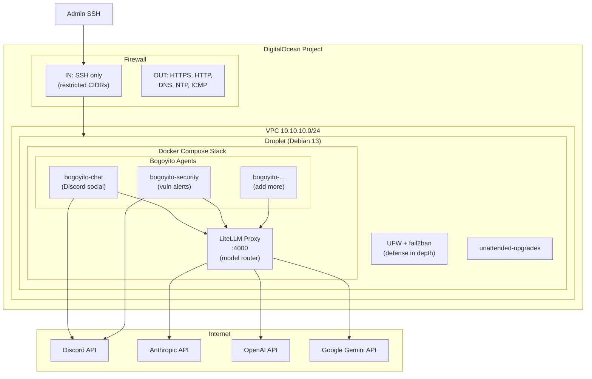
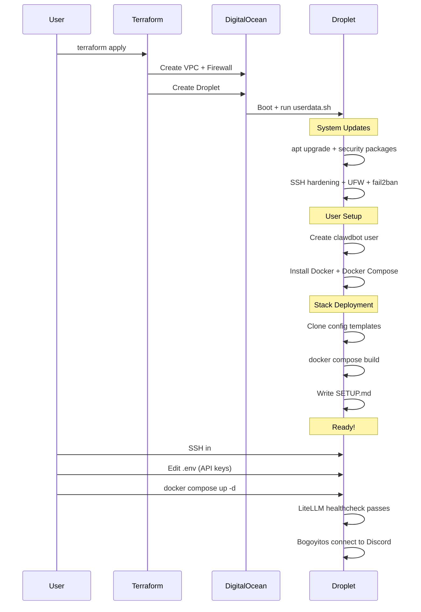

# clawdbot-do

DigitalOcean infrastructure for deploying a remote OpenClaw + LiteLLM multi-agent stack. Full bootstrap — `terraform apply` gives you a hardened droplet with Docker Compose running multiple Bogoyito agents through a unified LiteLLM model gateway.

## Architecture



### Bootstrap Flow



## Quick Start

```bash
# Clone
git clone https://github.com/drewpypro/clawdbot-do.git
cd clawdbot-do

# Configure
cp terraform.tfvars.example terraform.tfvars
# Edit terraform.tfvars with your values

# Deploy
terraform init
terraform plan
terraform apply

# SSH in and finish setup
ssh root@$(terraform output -raw droplet_ip)
su - clawdbot
cat ~/SETUP.md
```

## Project Structure

```
clawdbot-do/
├── .github/workflows/
│   ├── terraform-plan.yaml      # PR → format + validate + plan
│   ├── terraform-build.yaml     # Push to main → apply
│   └── terraform-destroy.yaml   # Manual → destroy
├── config/
│   ├── litellm.yaml             # LiteLLM model routing config
│   ├── chat.json                # Chat agent OpenClaw config
│   └── security.json            # Security agent OpenClaw config
├── openclaw/
│   └── Dockerfile               # OpenClaw container image
├── docker-compose.yml           # Full stack definition
├── .env.example                 # API key template
├── droplet.tf                   # Droplet + SSH key
├── networking.tf                # VPC + firewall rules
├── project.tf                   # DO project
├── providers.tf                 # Terraform config
├── variables.tf                 # Input variables
├── outputs.tf                   # Useful outputs
├── userdata.sh                  # Cloud-init bootstrap
└── terraform.tfvars.example     # Example tfvars
```

## Adding a New Bogoyito Agent

1. Create a config file in `config/`:
```json
{
  "model": "claude-sonnet",
  "baseUrl": "http://litellm:4000",
  "channels": { "discord": { "enabled": true } }
}
```

2. Add a service to `docker-compose.yml`:
```yaml
  bogoyito-newagent:
    build:
      context: ./openclaw
      dockerfile: Dockerfile
    container_name: bogoyito-newagent
    restart: unless-stopped
    depends_on:
      litellm:
        condition: service_healthy
    volumes:
      - ./config/newagent.json:/home/clawdbot/.openclaw/config.json:ro
      - bogoyito-newagent-data:/home/clawdbot/.openclaw/workspace
    env_file:
      - .env
```

3. `docker compose up -d bogoyito-newagent`

Each bogoyito is isolated — its own workspace, memory, and personality. They all route through LiteLLM for model access.

## CI/CD Workflows

| Workflow | Trigger | Action |
|----------|---------|--------|
| `terraform-plan.yaml` | PR to main | Format check, validate, plan |
| `terraform-build.yaml` | Push to main | Apply (requires `production` environment) |
| `terraform-destroy.yaml` | Manual dispatch | Destroy (requires `destroy` environment + confirmation) |

### Required Secrets

- `DIGITALOCEAN_TOKEN` — DO API token
- `SSH_PUBLIC_KEY` — Public SSH key for droplet access
- `ALLOWED_SSH_CIDR` — Your IP CIDR for SSH access

### Required Environments

- `production` — For apply workflow (recommended: require reviewers)
- `destroy` — For destroy workflow (recommended: require reviewers)

## Post-Deploy Setup

After `terraform apply`:

```bash
ssh root@<droplet_ip>
su - clawdbot
cat ~/SETUP.md    # Follow the guide
```

1. Copy `.env.example` to `.env` and populate API keys
2. Review configs in `config/` — enable/disable models in `litellm.yaml`
3. `docker compose up -d` — starts LiteLLM + all bogoyitos
4. Verify: `docker compose ps` and `curl http://localhost:4000/health`

## Security

- **No inbound web ports** — SSH only, restricted to specified CIDRs
- SSH key-only authentication (password auth disabled)
- DO firewall + UFW (defense in depth)
- fail2ban for brute-force protection
- Automatic security updates via unattended-upgrades
- Outbound restricted to HTTPS, HTTP, DNS, NTP (no arbitrary ports)
- LiteLLM binds to localhost only (127.0.0.1:4000)
- All secrets in `.env` (never committed — in `.gitignore`)
- Each bogoyito runs in its own container with isolated workspace

## Cost Estimate

| Resource | Monthly Cost |
|----------|-------------|
| 1x s-1vcpu-1gb Droplet | ~$6 |
| VPC / Firewall / Monitoring | Free |
| **Total** | **~$6/mo** |

> **Note:** For multiple agents, consider bumping to `s-2vcpu-2gb` (~$12/mo). Each OpenClaw instance + LiteLLM proxy adds ~200-400MB RAM overhead.

## Inspiration

Bootstrap-and-test pattern derived from:
- [`drewpypro/aws-privatelink-protocol-tester`](https://github.com/drewpypro/aws-privatelink-protocol-tester) — full test environment via userdata
- [`drewpypro/aws-vpce-policy-tester`](https://github.com/drewpypro/aws-vpce-policy-tester) — automated test harness on apply
- [`drewpypro/aws-backbone-routing-tester`](https://github.com/drewpypro/aws-backbone-routing-tester) — multi-instance bootstrap with scripts
