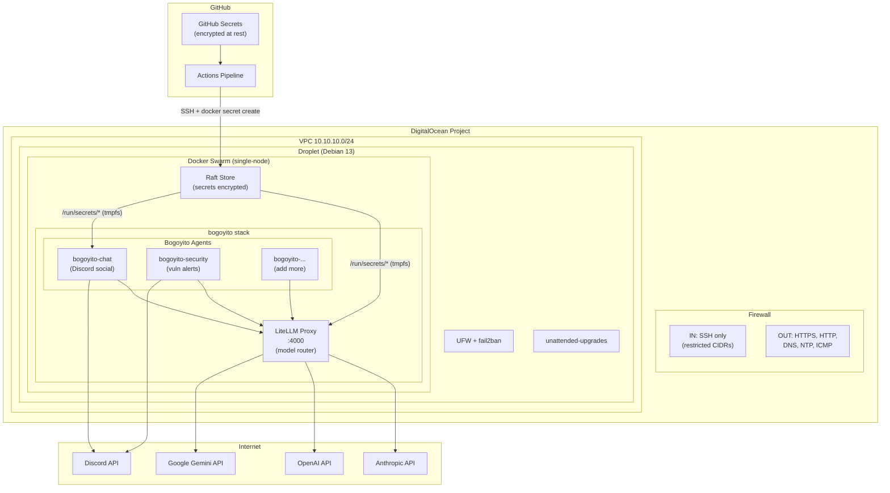
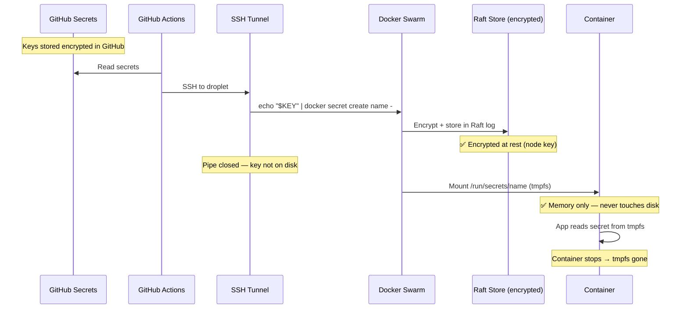
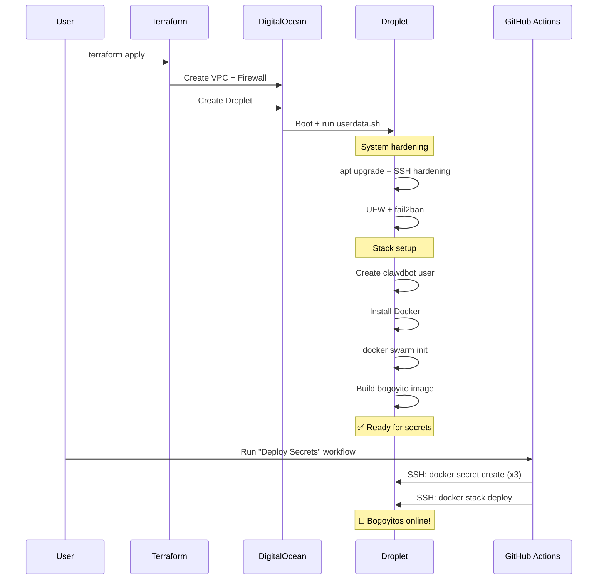

# clawdbot-do

DigitalOcean infrastructure for deploying a remote OpenClaw + LiteLLM multi-agent stack. Full bootstrap — `terraform apply` gives you a hardened droplet with Docker Swarm ready for secure secret injection. No API keys on disk. Ever.

## Architecture



### Secrets Flow



### Bootstrap Flow



## Quick Start

```bash
# Clone
git clone https://github.com/drewpypro/clawdbot-do.git
cd clawdbot-do

# Configure
cp terraform.tfvars.example terraform.tfvars
# Edit terraform.tfvars

# Deploy infrastructure
terraform init
terraform plan
terraform apply

# Then run "Deploy Secrets" workflow from GitHub Actions
# Or SSH in and follow ~/SETUP.md for manual setup
```

## Project Structure

```
clawdbot-do/
├── .github/workflows/
│   ├── terraform-plan.yaml      # PR → format + validate + plan
│   ├── terraform-build.yaml     # Push to main → apply infra
│   ├── terraform-destroy.yaml   # Manual → destroy infra
│   └── deploy-secrets.yaml      # Manual → push secrets + deploy stack
├── config/
│   ├── litellm.yaml             # LiteLLM model routing config
│   ├── chat.json                # Chat agent OpenClaw config
│   └── security.json            # Security agent OpenClaw config
├── openclaw/
│   └── Dockerfile               # OpenClaw container image
├── docker-compose.yml           # Stack definition (Swarm mode)
├── droplet.tf                   # Droplet + SSH key
├── networking.tf                # VPC + firewall rules
├── project.tf                   # DO project
├── providers.tf                 # Terraform config
├── variables.tf                 # Input variables
├── outputs.tf                   # Useful outputs
├── userdata.sh                  # Cloud-init bootstrap
└── terraform.tfvars.example     # Example tfvars
```

## Adding a New Bogoyito Agent

1. Create a config file in `config/`:
```json
{
  "model": "claude-sonnet",
  "baseUrl": "http://litellm:4000",
  "channels": { "discord": { "enabled": true } }
}
```

2. Add a service to `docker-compose.yml`:
```yaml
  bogoyito-newagent:
    image: bogoyito:latest
    depends_on:
      - litellm
    volumes:
      - ./config/newagent.json:/home/clawdbot/.openclaw/config.json:ro
      - bogoyito-newagent-data:/home/clawdbot/.openclaw/workspace
    secrets:
      - discord_bot_token
    environment:
      - DISCORD_BOT_TOKEN_FILE=/run/secrets/discord_bot_token
    deploy:
      restart_policy:
        condition: any
        delay: 10s
```

3. `docker stack deploy -c docker-compose.yml bogoyito`

## CI/CD Workflows

| Workflow | Trigger | Action |
|----------|---------|--------|
| `terraform-plan.yaml` | PR to main | Format check, validate, plan |
| `terraform-build.yaml` | Push to main | Apply infra |
| `terraform-destroy.yaml` | Manual dispatch | Destroy infra |
| `deploy-secrets.yaml` | Manual dispatch | Push secrets + deploy stack |

### Required GitHub Secrets

| Secret | Purpose |
|--------|---------|
| `DIGITALOCEAN_TOKEN` | DO API token (Terraform) |
| `SSH_PUBLIC_KEY` | Droplet SSH access |
| `SSH_PRIVATE_KEY` | Pipeline SSH to droplet |
| `DROPLET_IP` | Droplet public IP |
| `ALLOWED_SSH_CIDR` | SSH access CIDR |
| `ANTHROPIC_API_KEY` | Anthropic API key |
| `LITELLM_MASTER_KEY` | LiteLLM admin key |
| `DISCORD_BOT_TOKEN` | Discord bot token |

### Required Environments

- `production` — For apply + deploy workflows (recommended: require reviewers)
- `destroy` — For destroy workflow (recommended: require reviewers)

## Security

**Secrets:**
- No `.env` files — all secrets via Docker Swarm encrypted Raft store
- Secrets injected via SSH pipeline (GitHub → SSH pipe → `docker secret create`)
- Containers read from `/run/secrets/*` (tmpfs — memory only, never on disk)
- Secret rotation via workflow dispatch with `rotate=true`

**Infrastructure:**
- No inbound web ports — SSH only, restricted to specified CIDRs
- SSH key-only authentication (password auth disabled)
- DO firewall + UFW (defense in depth)
- fail2ban for brute-force protection
- Automatic security updates via unattended-upgrades
- Outbound restricted to HTTPS, HTTP, DNS, NTP
- LiteLLM binds to localhost only (127.0.0.1:4000)
- Each bogoyito in isolated container with own workspace

## Cost Estimate

| Resource | Monthly Cost |
|----------|-------------|
| 1x s-1vcpu-1gb Droplet | ~$6 |
| VPC / Firewall / Monitoring | Free |
| **Total** | **~$6/mo** |

> For multiple agents, consider `s-2vcpu-2gb` (~$12/mo).

## Inspiration

Bootstrap pattern derived from:
- [`drewpypro/aws-privatelink-protocol-tester`](https://github.com/drewpypro/aws-privatelink-protocol-tester)
- [`drewpypro/aws-vpce-policy-tester`](https://github.com/drewpypro/aws-vpce-policy-tester)
- [`drewpypro/aws-backbone-routing-tester`](https://github.com/drewpypro/aws-backbone-routing-tester)
